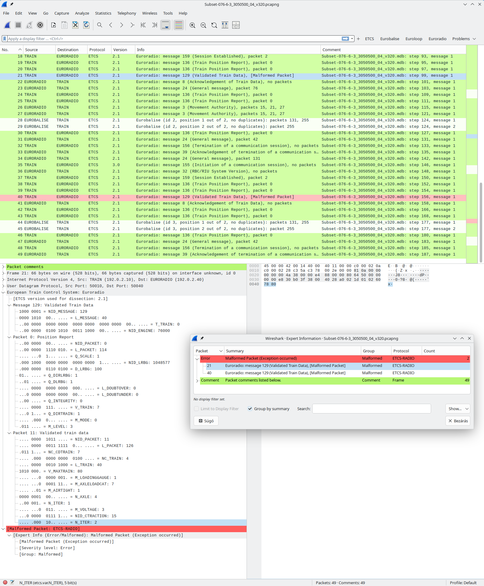

# ETCS Wireshark

Tooling to dissect [ETCS (European Train Control System)][ETCS B4 R1]
messages with Wireshark.

Currently, the application layer specified in SUBSET-026-8 is supported.



## Java application (MDB to PCAPNG)

This is an application to convert MDB files from [ETCS B4 R1][ETCS B4 R1]
SUBSET-076-6-3 into fake PCAPNG files for testing.

Supported Java version: 21.

To build:

```bash
./gradlew :mdb-to-pcapng:installDist
```

To use:

```bash
mdb-to-pcapng/build/install/mdb-to-pcapng/bin/mdb-to-pcapng \
    /path/to/mdb/file/or/directory
```

You may want to use `mergecap` (usually shipped with Wireshark) to merge the
PCAPNG files into one:

```bash
mergecap -a /path/to/*.pcapng -w all.pcapng
```

## Wireshark plugin

Supported Wireshark versions:

- Linux: 4.0, 4.2, 4.4
- Windows: 4.2, 4.4

### Building the plugin

To build the plugin, assuming that you have installed the Wireshark headers
and all necessary dependencies:

```bash
./build.sh
```

If you have Docker, you can use a plugin builder image that I have put together.
This builds the plugin both for Linux and for Windows:

```bash
./build-in-docker.sh
```

The built files are installed into `wireshark-config/my-plugins`.

### Using the plugin

You can use the included starter script which will load the plugin and a
Wireshark profile:

```bash
./wireshark.sh
```

## Limitations

The dissector plugin is written to support the application layer of the
telegrams described in SUBSET-026-8, pretending that this data is on top of
UDP. Obviously, this is not how the real protocol works. It should be easy
to make it work on top of other layers.

## Observations, notes

The `mdb-to-pcapng` tool reports many errors when trying to process all MDB
files from SUBSET-076-6-3. These can be categorized as follows:

- Some MDB files can not be opened. I haven't figured out the reason yet.
  (Maybe they are not supported by the library I'm using, or maybe
  they are corrupt or password-protected.)

- Values that were probably meant for human consumption instead of automatic
  processing.
  E.g.: `T_TRAIN` = `t_train_0`.

- Errors in the test case.
  E.g.: `M_DUP` = `64 d`. (`M_DUP` is only 2 bits long, so it can't be 64.)

- Values that do not follow the conventions, and our outside the heuristics
  implemented.
  E.g.: `M_LEVELTR` = `11`. (`M_LEVELTR` is 3 bits long. Arguably, this could
  be interpreted as `011 b`, corresponding to "Level 2".)

Once the resulting PCAPNG files are loaded into Wireshark, it also reports many
errors and warnings. They fall into the following categories:

- Intentionally invalid packets, e.g., usage of a `NID_PACKET` or `NID_MESSAGE`
  value that is absent from the specification.

- Errors in the test case.
  E.g.: in `Subset-076-6-3_3050500_04_v320`, the last packet in step 99 ends
  with `N_ITER` = `2 d`, which should have been followed by more data.

- Sometimes it is not clear which version of the specification to use for
  the decoding. In such a case, the message may be reported as invalid even
  though it could be decoded according to some other version.

- The dissector plugin could also have bugs. I haven't thoroughly checked all
  reported errors to determine their root cause.

## License

The Java application is released into the public domain.
See [LICENSE.CC0-1.0](LICENSE.CC0-1.0).

Wireshark is licensed under GPLv2 and plugins are considered to be derivative works.
Therefore, GPLv2 also applies to the source code of this plugin.
See [LICENSE.GPL-2.0-only](LICENSE.GPL-2.0-only).

## Repository maintenance

### Upgrade dependency locks

To upgrade locked dependencies:

```bash
./gradlew resolveAndLockAll --write-locks
```

## References

[ETCS B4 R1][ETCS B4 R1]

[ETCS B4 R1]: https://www.era.europa.eu/era-folder/1-ccs-tsi-appendix-mandatory-specifications-etcs-b4-r1-rmr-gsm-r-b1-mr1-frmcs-b0-ato-b1
